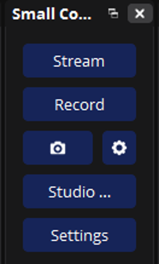

# Small Controls for OBS

[](https://github.com/nathan-v/small-controls-for-obs/blob/main/LICENSE)
[](https://obsproject.com/)
[](https://github.com/nathan-v/small-controls-for-obs/actions/workflows/ci.yml)
[](https://github.com/nathan-v/small-controls-for-obs/releases)
[](https://github.com/nathan-v/small-controls-for-obs/commits/main)



The OBS Controls dock, cut down to fit a narrow column.

OBS's built-in Controls dock will not go narrower than 150 px, so tucked into a side column it shoves the preview around. Small Controls is the same six buttons with shorter labels and a 60 px floor. Every button does exactly what the original does, through OBS itself; Stream, Record, Replay Buffer, Virtual Cam, Studio Mode and Settings.

> **It sits alongside the built-in dock.** Once Small Controls is where you want it, hide the original under View → Docks → Controls. Two things OBS does not open up to plugins, the virtual camera settings and the YouTube Go Live flow, are handed to the built-in dock's own buttons behind the scenes, and they keep working while that dock is hidden.

If you have questions or want to talk about this plugin you can find me on [Twitch](https://twitch.tv/The_Nathan_V).

## Contents

- [What it does](#what-it-does)
- [Getting started](#getting-started)
- [How you would actually use it](#how-you-would-actually-use-it)
- [Staying safe](#staying-safe)
- [Status](#status)
- [For developers](#for-developers)
- [License](#license)

## What it does

- **Shorter labels.** Stream, Record, Replay Buffer, Virtual Cam. When even those will not fit, the label shortens with an ellipsis and the full name stays in the tooltip.
- **Goes down to 60 px.** One short button plus the small icon beside it; that is as narrow as it gets, well under the 150 px the built-in dock insists on.
- **Same colours, same states.** Live and recording buttons light up the way your theme paints the originals, and "Stopping..." shows while OBS winds an output down.
- **Nothing missing.** The pause and save-replay icons, the virtual camera settings gear, the YouTube Go Live button and the stream-delay stop menu are all there.
- **Never phones home.** No analytics, no tracking, no update checks; this plugin does _not_ call home in any way.

| Built-in             | Small Controls |
| -------------------- | -------------- |
| Start Streaming      | Stream         |
| Start Recording      | Record         |
| Start Replay Buffer  | Replay Buffer  |
| Start Virtual Camera | Virtual Cam    |
| Studio Mode          | Studio Mode    |
| Settings             | Settings       |

## Getting started

You need OBS Studio 30 or newer. Grab the build for your computer from the [releases page](https://github.com/nathan-v/small-controls-for-obs/releases) and install it:

| Platform | How |
| --- | --- |
| Windows | Run `small-controls-for-obs-<version>-windows-x64-installer.exe`. It asks you to close OBS first and adds an uninstaller to Windows Settings. |
| macOS | Open the `.pkg`, or copy `small-controls-for-obs.plugin` into `~/Library/Application Support/obs-studio/plugins/`. |
| Linux | Install the `.deb` on Ubuntu, or put `small-controls-for-obs.so` in `~/.config/obs-studio/plugins/small-controls-for-obs/bin/64bit/` and the `data` folder next to `bin`. |

On macOS the `.pkg` and the plugin inside it are signed only with an ad-hoc signature and are not notarized, so Gatekeeper will say the package is from an unidentified developer. Control-click the `.pkg` and choose Open, or allow it under System Settings → Privacy & Security, after checking its checksum.

Restart OBS, open **Docks → Small Controls**, and drag it into a side column. Every release lists SHA-256 checksums; check your download against them before installing.

## How you would actually use it

**Building a slim side column.** Drag Small Controls into the left or right dock area, then pull the splitter in until the labels start to shorten. At 60 px every button still works and the tooltip tells you which is which. Pair it with [Vertical Stats for OBS](https://github.com/nathan-v/vertical-stats-for-obs) for a whole column that does not eat your preview.

**Going live on YouTube.** If OBS is connected to a YouTube account, the Go Live button appears next to Stream, exactly as on the built-in dock. It is the same button; clicking it presses OBS's own.

**Using a stream delay.** With a delay set under Settings → Advanced, clicking Stop Stream while live offers the same two choices the built-in dock does: Stop Stream, which plays out the delay, or Force Stop Streaming, which drops it.

**Virtual camera at its narrowest.** When the column is too tight for the words, the Virtual Cam button turns into your theme's camera icon. The gear beside it still opens the virtual camera settings.

**Recording.** Once a recording starts, a pause button appears next to Record if your recording format can pause. While paused the save-replay button is greyed out, same as the original.

## Staying safe

- **It runs inside OBS.** Like every OBS plugin it loads into the OBS process with the same access OBS has. Install builds from the releases page and check the checksums, or build it yourself.
- **It reads your profile, never writes it.** The output mode, replay buffer and stream delay settings decide which buttons to show. Nothing is changed.
- **It presses two of OBS's own buttons.** The virtual camera settings and YouTube Go Live have no plugin API, so the plugin clicks the built-in dock's buttons for you. Nothing happens that you could not do by clicking them yourself.
- **No network.** The plugin opens no connections; streaming goes through OBS's own outputs.

See [SECURITY.md](SECURITY.md) to report a problem.

## Status

Working. Verified by hand in OBS on macOS (where the screenshot comes from) and Windows. The Linux build passes CI and the headless test suite runs on all three, but the dock has had less time in a real OBS there. Themes style it through the same widget names as the built-in dock, so any OBS theme should look right; if one does not, open an issue with the theme name.

## For developers

Built on the official [obs-plugintemplate](https://github.com/obsproject/obs-plugintemplate); CMake 3.28+.

```bash
cmake --preset macos                                   # or windows-x64, ubuntu-x86_64; first run downloads OBS and Qt
cmake --build --preset macos --config RelWithDebInfo
cmake --install build_macos --config RelWithDebInfo --prefix release
```

Ubuntu wants `build-essential cmake ninja-build pkg-config libobs-dev obs-studio qt6-base-dev qt6-base-private-dev` from apt first. The Windows installer needs [Inno Setup 6](https://jrsoftware.org/isinfo.php); `pwsh ./installer/windows/build-installer.ps1`.

The dock has a headless test suite that compiles the widget against a fake libobs, so it runs without an OBS install but needs the OBS headers the plugin configure fetches:

```bash
cmake --preset macos -DENABLE_TESTS=ON
cmake --build --preset macos --config RelWithDebInfo
ctest --preset macos
```

It covers button state and labels for every frontend event, replay and virtual camera availability from the profile, click routing, the forwarded built-in buttons, label eliding and the sub-150 px minimum width. Theme styling and real OBS event ordering still need a running OBS.

Format check before pushing; `./build-aux/run-clang-format --check` (clang-format 19.1.x) and `./build-aux/run-gersemi --check`.

`.github/workflows/ci.yml` runs both format checks, the test suite on Ubuntu, macOS and Windows, and builds all three platforms with the Windows installer on every push and pull request. A `x.y.z` tag creates a draft release with checksums. [CONTRIBUTING.md](CONTRIBUTING.md) has the workflow.

## License

GPL-2.0-or-later; see [LICENSE](LICENSE). Modelled on OBS Studio's `frontend/widgets/OBSBasicControls.cpp` (Copyright (C) 2023 Lain Bailey, GPL v2+). PRs and constructive feedback are welcome.
